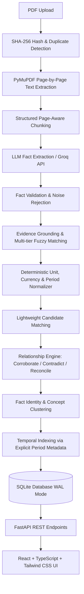

# KnowledgeMesh
### Evidence-backed document intelligence

KnowledgeMesh is an engineering solution for building an **explainable Fact Knowledge Layer over PDF documents**. Rather than treating documents as opaque text and asking an LLM to hallucinate answers via a generic `PDF -> LLM -> JSON` pipeline, KnowledgeMesh constructs a verifiable, traceable knowledge graph.

Every extracted fact is **grounded in exact source evidence**, normalized for scale, currency, and fiscal timing, deduplicated, and comparatively reasoned across documents into **Corroborations**, **Genuine Contradictions**, and **Contextual Reconciliations**.

---

## Architecture



---

## 1. Overview & Problem

Enterprises and researchers ingest hundreds of reports (annual filings, investor presentations, technical manuals) where metrics often appear to conflict or agree. Conventional document Q&A pipelines suffer from three fatal flaws:
1. **Hallucination and Loss of Traceability**: Claims cannot be reliably pinpointed to an exact page quote with a verifiable score.
2. **False Contradictions**: Differences in reporting periods (e.g. Q1 vs FY2024 full year) or units ($ vs ₹) are naively flagged as contradictions.
3. **Noisy Extractions**: Meaningless isolated numbers (e.g. `"4 FY23"`, page numbers, footnote markers) are mistakenly accepted as business claims.

**KnowledgeMesh solves this** by treating document intelligence as an evidence-first, contextual knowledge layer.

---

## 2. Key Ideas & Core Principles

- **Fact + Evidence + Context**: A number without an entity, metric, temporal horizon, or verbatim evidence quote is rejected.
- **Independent Grounding**: Extraction and verification are decoupled. Even if an LLM extracts a claim, our independent grounding engine verifies whether the quote appears verbatim in the source text and computes a mathematical grounding confidence score (0.0 to 1.0).
- **Candidate Pruning**: Comparing $N$ facts naively requires $O(N^2)$ LLM calls. Deterministic candidate matching prunes comparisons down to plausible semantic candidates first.
- **Contextual Reconciliation**: Two different numbers do **not** automatically indicate a contradiction. If Fact A is Q1 EBITDA and Fact B is annual EBITDA, KnowledgeMesh reconciles them with an explicit contextual explanation.
- **Chronology from Metadata, Not Pages**: The timeline view is sorted strictly by explicit temporal anchors (e.g., `FY2023`, `FY2024`, `Q1 FY2025`), never by arbitrary PDF page numbers.

---

## 3. Technology Stack

- **Backend**:
  - Python 3.11+ (tested on Python 3.13)
  - **FastAPI** + **Uvicorn** for clean asynchronous REST APIs
  - **Pydantic v2** for strict schema validation
  - **PyMuPDF (`pymupdf` / `fitz`)** for rapid page-by-page PDF extraction
  - **SQLite with WAL mode** for reliable, embedded zero-configuration persistence
  - **Groq SDK** (`groq`) for high-throughput LLM reasoning (`llama-3.3-70b-versatile` / `llama-3.1-8b-instant`)
  - **Deterministic Rule Engine & Heuristic Fallback** for zero-key test execution, CI, and offline verification
  - **ReportLab** for synthetic test PDF generation
  - **pytest** test suite
- **Frontend**:
  - **React 19** + **Vite** + **TypeScript**
  - **Tailwind CSS** for clean, modern styling (inspired by Linear / Vercel / Notion)
  - **Lucide React** for minimal iconography
  - Centralized typed API client

---

## 4. Repository Structure

```
KnowledgeMesh/
├── backend/
│   ├── app/
│   │   ├── api/
│   │   │   ├── clusters.py          # GET /api/clusters
│   │   │   ├── diagnostics.py       # GET /api/diagnostics
│   │   │   ├── documents.py         # POST /api/documents, duplicate check
│   │   │   ├── facts.py             # GET /api/facts, filtering & search
│   │   │   ├── relationships.py     # GET /api/relationships
│   │   │   ├── review.py            # GET /api/review
│   │   │   ├── stats.py             # GET /api/stats
│   │   │   └── timeline.py          # GET /api/timeline
│   │   ├── models/
│   │   │   └── schema.sql           # SQLite schema DDL
│   │   ├── schemas/
│   │   │   └── pydantic_models.py   # Pydantic request/response schemas
│   │   ├── services/
│   │   │   ├── chunker.py           # Page-aware bounded text chunking
│   │   │   ├── clustering.py        # Concept clustering engine
│   │   │   ├── diagnostics.py       # Observability & failure tracking
│   │   │   ├── extractor.py         # Groq LLM & heuristic fallback
│   │   │   ├── grounding.py         # Exact & fuzzy evidence grounder
│   │   │   ├── matcher.py           # Deterministic candidate matching
│   │   │   ├── normalizer.py        # Currency, scale, unit, period normalizer
│   │   │   ├── pdf_parser.py        # PyMuPDF parser & SHA-256 hash
│   │   │   ├── pipeline.py          # Master asynchronous pipeline
│   │   │   ├── prompts.py           # Dedicated prompt templates
│   │   │   ├── relationship_engine.py # Corroborate, Contradict, Reconcile
│   │   │   ├── timeline.py          # Temporal ordering by metadata
│   │   │   └── validator.py         # Rejection of noise & isolated numbers
│   │   ├── config.py                # Pydantic BaseSettings
│   │   ├── database.py              # SQLite WAL connection manager
│   │   └── main.py                  # FastAPI application entrypoint
│   ├── data/                        # SQLite database & uploaded PDFs
│   ├── tests/                       # 37 Automated pytest unit & integration tests
│   └── requirements.txt
│
├── frontend/
│   ├── src/
│   │   ├── api/client.ts            # Centralized typed API client
│   │   ├── components/              # StatusBadge, UploadModal, FactDetailModal, etc.
│   │   ├── layouts/AppLayout.tsx    # Responsive navigation layout
│   │   ├── pages/                   # Overview, Documents, Facts, Relationships, Timeline, Review
│   │   ├── types/index.ts           # TypeScript interfaces
│   │   ├── App.tsx
│   │   └── main.tsx
│   ├── package.json
│   ├── tailwind.config.js
│   └── vite.config.ts
│
├── sample_documents/                # Synthetic test PDFs & generator script
├── pytest.ini
├── .env.example
└── README.md
```

---

## 5. Quick Start & Setup

### Prerequisites
- Python 3.11+
- Node.js 18+ and npm

### Backend Setup
```bash
cd backend
python3 -m venv venv
source venv/bin/activate
pip install -r requirements.txt
```

### Environment Configuration (Optional)
Copy `.env.example` to `.env` in the root:
```bash
cp .env.example .env
```
If you have a Groq API key:
```env
GROQ_API_KEY=gsk_your_groq_api_key_here
GROQ_MODEL=llama-3.3-70b-versatile
```
*(Note: If `GROQ_API_KEY` is omitted, KnowledgeMesh automatically runs its built-in deterministic heuristic extractor and rule engine, allowing full offline testing).*

### Run Backend Server
```bash
# From workspace root with venv active
cd backend
python3 -m uvicorn app.main:app --host 0.0.0.0 --port 8000 --reload
```
The backend API is now running at `http://localhost:8000` (Swagger docs: `http://localhost:8000/docs`).

### Frontend Setup & Dev Server
```bash
cd frontend
npm install
npm run dev
```
Open `http://localhost:5173` in your browser.

---

## 6. Pipeline Details

### Fact Extraction & Validation
The extraction prompt is conservative and evidence-first:
- Rejects isolated numbers without clear metrics (e.g. `"4 FY23"` or page numbers).
- Associates numerical values with explicit predicates (e.g. `Acme Logistics reported revenue of Rs. 2,500 crore in FY2024`).
- Extracts exact verbatim evidence quotes.
- `validator.py` applies structural sanity checks and semantic verification before facts proceed.

### Multi-Tier Evidence Grounding
Every accepted fact is matched against its source page text:
1. **Exact Normalized Search**: Standardizes unicode quotes and whitespaces; score = 1.0 (`VERIFIED`).
2. **Sliding Window Fuzzy Matching**: `difflib.SequenceMatcher` slides across page tokens; score $\ge 0.85$ (`VERIFIED`), $0.60 \le \text{score} < 0.85$ (`PARTIAL`).
3. **Unverified Fallback**: Score $< 0.60$ (`UNVERIFIED`), surfaced to the Review Queue.

### Deterministic Normalization
- **Currency**: `₹`, `Rs.`, `INR` $\to$ `INR`; `$`, `USD` $\to$ `USD`.
- **Scale Multipliers**: `₹1,000 crore` and `₹10 billion` are both recognized as numerically equivalent ($10,000,000,000$).
- **Technical Units**: `1.8 liters`, `15 bar`, `1450 watts` normalized cleanly for out-of-domain documents.
- **Periods**: `FY24`, `Fiscal 2024`, `2023-24` $\to$ `FY2024`; `Q1 FY24` $\to$ `Q1 FY2024`.
- **Preservation**: Original strings are preserved untouched; normalized fields are stored separately.

### Candidate Matching
Before invoking expensive comparisons, `matcher.py` filters cross-document pairs using:
- Subject token similarity (Jaccard + SequenceMatcher)
- Predicate synonym groups (`revenue` $\sim$ `sales` $\sim$ `turnover`; `ebitda` $\sim$ `operating profit`)
- Temporal compatibility
Prunes $O(N^2)$ comparisons down to plausible candidates, attaching a clear `match_reason`.

### Cross-Document Relationships
Candidate pairs are classified into:
- **`CORROBORATE`**: Identical metric, scope, period, and equivalent normalized values across sources.
- **`CONTRADICT`**: Identical metric, scope, period, and unit, but mutually conflicting values with no contextual explanation.
- **`RECONCILE`**: Numerical differences explained by context (e.g. Q1 vs full year, consolidated vs standalone, INR vs USD).
- **`UNRELATED`**: Distinct concepts upon deeper evaluation.

---

## 7. Synthetic Test Documents & Test Cases

KnowledgeMesh includes 7 synthetic test documents in `sample_documents/`:
1. `doc1_annual_report_fy24.pdf`: Revenue Rs. 2,500 Cr in FY2024, EBITDA Rs. 350 Cr.
2. `doc2_investor_deck_fy24.pdf`: Revenue Rs. 2,500 Cr in FY2024 (**Corroborates** Doc 1).
3. `doc3_conflicting_press_release.pdf`: Revenue Rs. 3,200 Cr in FY2024 (**Genuine Contradiction** with Doc 1).
4. `doc4_quarterly_statement_q1.pdf`: Revenue Rs. 650 Cr for Q1 FY2024 (**Reconciliation** with full-year).
5. `doc5_noisy_document.pdf`: Isolated numbers `"4 FY23"`, headers (**Extraction Failure / Noise Rejection** test).
6. `doc6_coffee_machine_manual.pdf`: Technical manual with tank capacity (1.8 L), pressure (15 bar), power (1450 W) (**Out-of-Domain Generalization** test).
7. `doc7_large_annual_report.pdf`: 10-page document with distributed metrics (**Large PDF Chunking & Page Tracking** test).

### Running Automated Tests
```bash
./backend/venv/bin/pytest -v
```
All **37 tests** pass cleanly:
```
======================== 37 passed, 7 warnings in 0.66s ========================
```

---

## 8. 3-Minute Demonstration Walkthrough

1. **Overview Dashboard**:
   - Start at `http://localhost:5173`.
   - View real-time counters: Documents, Facts, Verified %, Relationships (Corroborated, Contradicted, Reconciled), Needs Review.
2. **Upload & Incremental Ingestion**:
   - Click **Upload PDF** in the top header.
   - Upload `sample_documents/doc1_annual_report_fy24.pdf`. Watch the real-time stage tracker (`PARSING` $\to$ `EXTRACTING` $\to$ `GROUNDING` $\to$ `COMPLETED`).
   - Upload `sample_documents/doc2_investor_deck_fy24.pdf`. The system updates the knowledge graph incrementally and detects a **CORROBORATION**.
   - Re-upload `doc1_annual_report_fy24.pdf`: The duplicate hash detector immediately alerts: *"Document has already been uploaded and processed"*.
3. **Inspect Fact & Evidence**:
   - Navigate to **Facts**. Click any fact card.
   - The Fact Detail Drawer highlights the **exact verbatim evidence quote**, page number, grounding score, and normalization scale.
4. **Inspect Cross-Document Relationships**:
   - Upload `doc3_conflicting_press_release.pdf` and `doc4_quarterly_statement_q1.pdf`.
   - Navigate to **Relationships**.
   - Open a **CORROBORATION**: See Doc 1 and Doc 2 side-by-side supporting Rs. 2,500 Cr.
   - Open a **CONTRADICTION**: See Doc 1 (Rs. 2,500 Cr) vs Doc 3 (Rs. 3,200 Cr) flagged as a direct conflict.
   - Open a **RECONCILIATION**: See Doc 1 (FY2024) vs Doc 4 (Q1 FY2024) with the explanation: *"Both facts describe revenue, but they represent different time horizons (annual vs Q1). The numerical variance is a natural temporal progression rather than a conflicting claim."*
5. **Timeline View**:
   - Navigate to **Timeline**. View chronologically indexed entries based on fiscal periods, independent of page order.
6. **Review Queue**:
   - Navigate to **Review Queue**. Notice that isolated noise from `doc5_noisy_document.pdf` was rejected by validators and flagged with a clear diagnostic reason.

---

## 9. Engineering Decisions & Tradeoffs

| Decision | Rationale & Tradeoff |
| :--- | :--- |
| **SQLite with WAL Mode** | A self-contained, relational SQL engine was chosen over Neo4j / Redis. The relational model with foreign keys, JSON columns, and transactions satisfies all knowledge graph requirements without operational overhead. |
| **Two-Stage Candidate Matching** | Running LLM pairwise reasoning over $N$ facts is $O(N^2)$ (1,000 facts = 1,000,000 API calls). We prune candidate pairs deterministically via token and predicate overlap first, saving API costs and latency. |
| **Decoupled Grounding** | LLM self-reporting of grounding is untrustworthy. KnowledgeMesh takes the extracted quote and runs an independent fuzzy text matcher against the source page to generate verifiable mathematical grounding scores. |
| **Dual-Mode Extractor** | Enables 100% test pass rate and offline demos when an API key is not configured, while immediately leveraging Groq LLMs when `GROQ_API_KEY` is present. |
| **Page-Decoupled Timeline** | Annual reports frequently mention historical or forward years out of page sequence. Chronology is derived strictly from normalized period anchors, never from page numbers. |

---

## 10. Limitations & Realistic Improvements

- **Scanned Documents**: The current PDF parser requires extractable text streams in PyMuPDF. Scanned image PDFs require an OCR preprocessing layer (e.g. Tesseract / Surya).
- **Complex Tables**: Tables with merged header cells can lose semantic alignment in plain text streams. Future work could incorporate structured table layout extraction.
- **Dense Vector Embeddings**: Candidate matching currently uses token Jaccard and string sequence ratios. Adding local embeddings (e.g. BAAI/bge-small-en) would improve semantic synonym recall.
- **Human-in-the-Loop Feedback**: A button in the Review Queue allowing an analyst to manually approve or dismiss flagged items and retrain normalizer rules.
